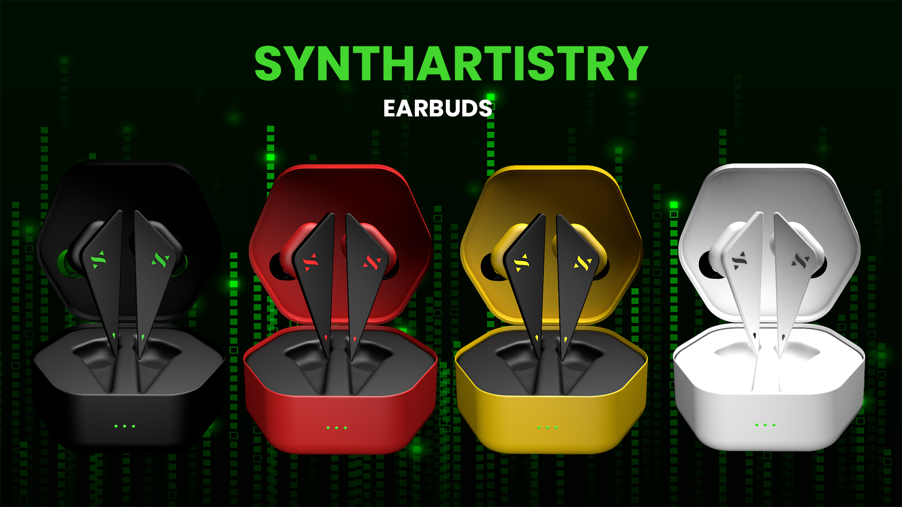

# Gaming Earbuds Concept Design

This repository contains the concept design and development process for Gaming Earbuds, featuring a sleek 3D model created in Cinema 4D. The project focuses on creating a visually appealing and functional design tailored for gamers. It also explores advanced modeling techniques like mirroring, realistic rendering, and conceptual branding for the earbuds. Added it to a webpage to with different features such as vertical scrolling, color selector, hotspot rendering and x-ray slider.

## Features

- 3D Model Design: A detailed, high-quality model of gaming earbuds designed for immersive gaming sessions.
- Cinema 4D Workflow: Includes project files showcasing the use of Cinema 4D for modeling, rendering,and mirroring techniques.
- Concept Branding: A unique identity for the earbuds, including logo integration and potential packaging ideas.
- Dynamic Visuals: Experimentation with rendering styles, lighting, and materials to achieve a premium look.
- Creative Innovation: Exploring new design ideas for gaming accessories.

## Tools Used

- Cinema 4D: For 3D modeling and rendering.
- Photoshop/Illustrator: For texture creation and branding elements.
- After Effects: For animation or additional rendering.
- GreenSocks for visualization effects in the webpage using scroll.

## Goals

- Design a modern and ergonomic pair of earbuds for gaming enthusiasts.
- Deliver high-quality renders for promotional and conceptual purposes.
- Create a mirrored version of the model for a complete stereo pair.
- Provide assets that could be used for further animation or advertising.

## Contribution

Contributions are welcome! If you have ideas to improve the design or workflow, feel free to submit a pull request or open an issue.

## Installation

1. Click on the link to the sample repository provided;
2. On the repo, click on the green button "< > Code";
3. On the last option, click on "Download zip";
4. Unzip the folder.

## Usage

1. Download the folder on your device;
2. Open the index.html file on the browser of your choice.

## History

No history required

## Credits

Sheldon P. Gohetia

## License

MT - Copyright (c) 2024 Sheldon Gohetia.
